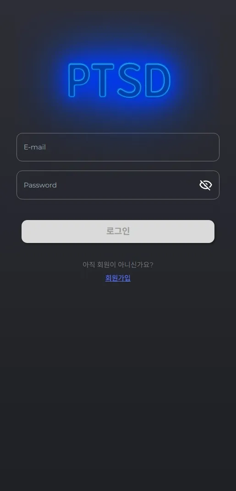
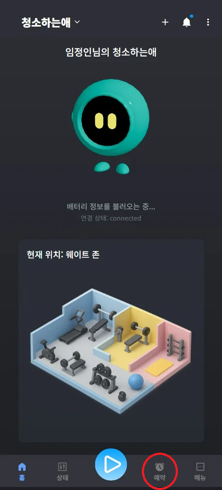
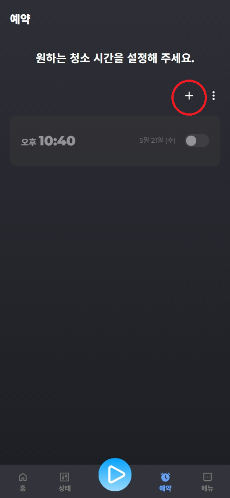
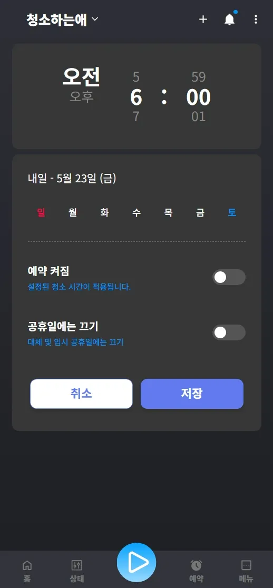
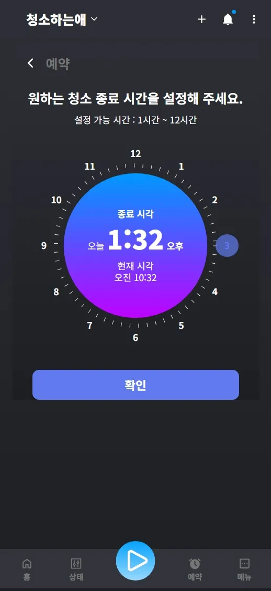
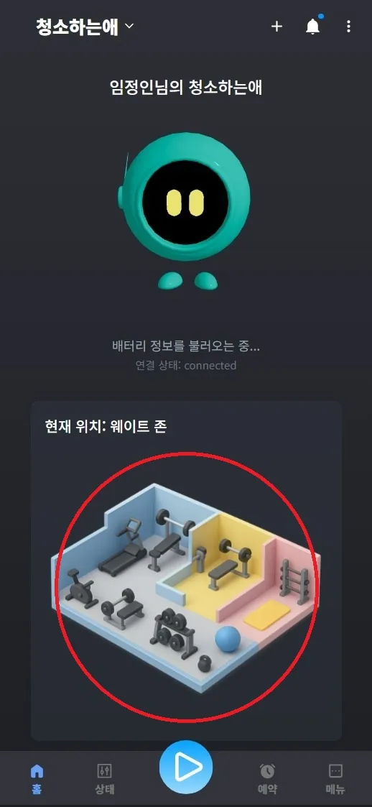
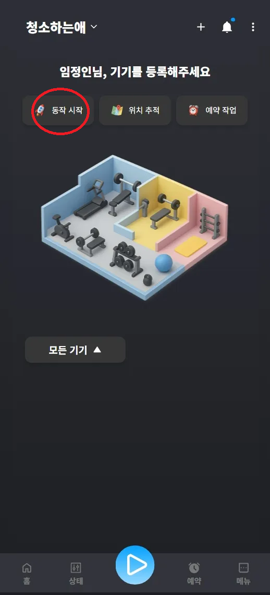
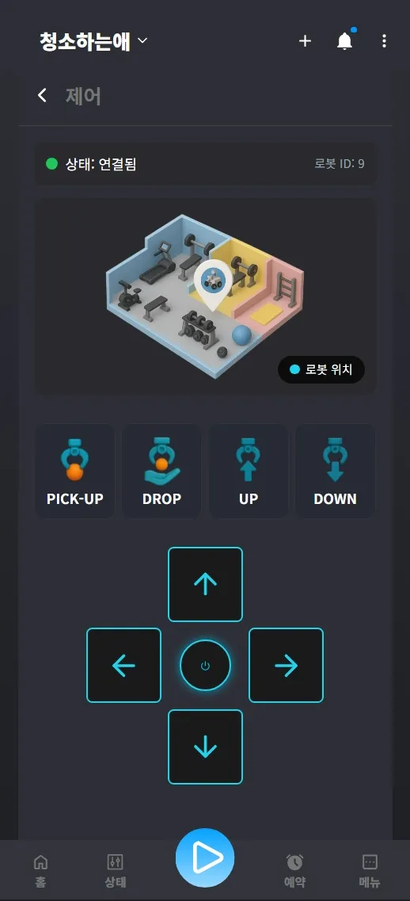

# Porting Manual
## 🛠️ 1. 사용 도구
- 이슈 관리 : Jira
- 형상 관리 : GitLab
- 커뮤니케이션 : Notion, MatterMost
- 디자인 : Figma
- CI/CD : Jenkins

## 💻  2. 개발 도구
- Visual Studio Code : 버전 1.99.3

## ⚙️ 3. 개발 환경
### ✔️ Frontend
| 기술 | 버전 |
| --- | --- |
| Node.js | v20.11.1 |
| React | 19.0.0 |

### ✔️ Backend
| 기술 | 버전 |
| --- | --- |
| Fastapi | 0.115.12 |
| Python | 3.10.0 |

### ✔️ Server
| 구성 요소 | 상세 정보 |
|-----------|------------|
| AWS EC2 |  CPU : Intel(R) Xeon(R) CPU E5-2686 v4 @ 2.30GHz<br>RAM : 16GB<br>OS : Ubuntu |
| Nginx | 1.27.4 |
| Jenkins | 2.492.2 |
| Docker | 28.0.1 |
| Ubuntu | 22.04.5 LTS |

### ✔️ Hardware
| 구성 요소 | 상세 정보 |
|-----------|------------|
| Ubuntu | 22.04 LTS |
| ROS 2 | Humble |

### ✔️ Database
| 기술 | 버전 |
|------|------|
| PostgreSQL | 17.4 |

## 🔐 4. 환경변수 형태
### Backend
- `backend/PTSD/.env`
    
    ```bash
    DATABASE_URL=postgresql://ptsd:[비밀번호]@[서버주소]:5432/ptsd
    MQTT_BROKER=[서버주소]
    MQTT_PORT=1883
    ```
        
### Frontend
- `frontend/.env.development`
    
    ```jsx
    # 로컬
    VITE_API_BASE_URL=http://[서버주소]:8000/api
    VITE_WS_URL=ws://[서버주소]:8000/ws/manual-control
    VITE_WS_AUTO_CONTROL_URL=ws://[서버주소]:8000/ws/auto-control
    VITE_NOTIFICATION_WS_URL=ws://[서버주소]:8000/ws/notifications
    VITE_ROBOT_ARM_WS_URL=ws://[서버주소]:8000/ws/robot-arm
    ```
    
- `frontend/.env.production`
    
    ```jsx
    # 서버
    VITE_API_BASE_URL=https://[서버주소]/api
    VITE_WS_URL=wss://[서버주소]/ws/manual-control
    VITE_WS_AUTO_CONTROL_URL=wss://[서버주소]/ws/auto-control
    VITE_NOTIFICATION_WS_URL=wss://[서버주소]/ws/notifications
    VITE_ROBOT_ARM_WS_URL=wss://[서버주소]/ws/robot-arm
    ```
        

## 5. CI/CD 구축
[BE/FE Jenkins 스크립트 및 Docker 설정 파일 ](https://www.notion.so/BE-FE-Jenkins-Docker-204e605dad4d81b89e04ff9b2074f0a9?pvs=21)

[Docker DooD 방식 CI/CD 인프라 구축 과정 ](https://www.notion.so/Docker-DooD-CI-CD-204e605dad4d81c6b440e54c41ab6613?pvs=21)

[DB 및 Nginx (certbot) 웹 서버 컨테이너 구성 ](https://www.notion.so/DB-Nginx-certbot-204e605dad4d8116ac6dc7407cbd69a4?pvs=21)

## 6. 로컬 실행

### ✔️ 백엔드

**경로 이동**
> /c/embedded/S12P31D101/backend 디렉토리에서 모든 명령어를 실행합니다.
> 

---

### 1️⃣ 가상환경 설정

```bash
python -m venv venv
```

- 가상환경 생성

```bash
source venv/Scripts/activate
```

- 가상환경 활성화 (Windows 기준)

---

### 2️⃣ 의존성 설치

```bash
pip install -r requirements.txt
```

- `requirements.txt`를 기준으로 의존성 패키지 설치

---

### 3️⃣ 패키지 추가 시

```bash
pip freeze > requirements.txt
```

- 새로 설치한 패키지를 `requirements.txt`에 반영
- 팀원이 `pip install -r requirements.txt`로 동일 환경 구축 가능

---

### 4️⃣ 서버 실행

```bash
uvicorn PTSD.main:app --reload
```

- FastAPI 서버 실행
- `-reload` 옵션으로 코드 변경 시 자동 반영됨 (개발용)

---

### ✅ 참고

- Mac/Linux일 경우 가상환경 활성화 명령어는 다를 수 있습니다

### ✔️ 프론트엔드

### 1️⃣ 의존성 설치

```bash
npm i
```

- `package.json`에 명시된 모든 의존성 패키지 설치
- 프로젝트 최초 세팅 시 1회 실행

### 2️⃣ 개발 서버 실행

```bash
npm run dev
```

- 개발용 서버 실행
- 브라우저에서 자동으로 열리며, 코드 수정 시 실시간 반영됨
- 기본 포트는 `http://localhost:5173` (Vite 기준)

### PWA 빌드 (배포용)

```bash
npm run build
```

- 프로덕션(배포)용 정적 파일 빌드
- 결과물은 `/dist` 디렉토리에 생성됨
- 이 디렉토리를 Nginx 등으로 서비스할 수 있음

### 로컬 서버에서 빌드 확인 (선택)

```bash
npm run preview
```

- `npm run build`로 생성된 `/dist` 폴더를 로컬에서 미리보기 실행
- 실제 배포 환경과 유사한 형태로 확인 가능

### ✅ 참고

- PWA 환경이 적용되어 있어 설치 가능한 웹 앱 형태로 작동합니다.
- `.env` 파일을 사용하여 API 주소 등 환경별 설정을 관리할 수 있습니다.
- 실행 전 `.env` 파일이 존재하는지 확인하세요.

### ✔️ 터틀봇 실행 방법

### raspberry pi SBC

> bringup 파일 실행

```jsx
ros2 launch <pkg 명> <node 명>
```

- 배터리 상태

```jsx
ros2 run <pkg 명> <node 명> 
```

- 로봇 팔 블루투스 통신

```jsx
sudo rfcomm bind <블루투스 연결 경로> <블루투스 시리얼 넘버>
```

- 로봇 팔 제어

```jsx
ros2 run <pkg 명> <node 명>
```

- 수동 제어

```jsx
ros2 run <pkg 명> <node 명>
```

### RemotePC
- navigation 실행
```jsx
ros2 launch <pkg 명> <node 명> map:=<파일경로>/<파일명>
```

- 자율 주행 실행
```jsx
ros2 run <pkg 명> <node 명>
```

## 7. 시연시나리오

[시연시나리오](https://www.notion.so/204e605dad4d81539808eeb1f57f8966?pvs=21)

1. **로그인**
<div align="center">
  
</div>    

2. **메인화면**
<div align="center">
  
</div> 
    

3. **예약: 시간예약, 타이머**

메인화면 → 예약 이동

<p align="center">
  
  
  
</p>


4. **수동제어**  
<p align="center">
  
  
  
</p>